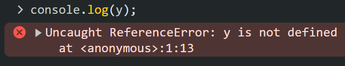
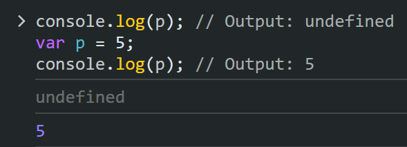
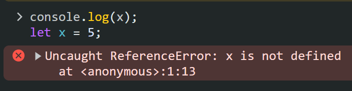
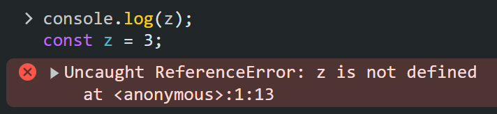

# JavaScript Hoisting

## 📖 The dictionary meaning of Hoisting:
Raise (something) by means of ropes and pulleys.

##📚 JavaScript definition:

Hoisting is a behavior where variable and function declarations are moved to the top of their containing scope during the compilation phase, before the code is executed.

Breakdown of how hoisting works for functions and variables:

## ⚙️ Functions: 

Declared functions are entirely hoisted. You can call a function even before it's written in the code.

## 📝 Variables:

With var declarations, only the declaration is hoisted, not the initialization. This means the variable exists before its assigned value, resulting in a value of undefined if used before initialization.

```javascript
console.log(y);  // Output: Uncaught ReferenceError: x is not defined
```


```javascript
console.log(p); // Output: undefined
var p = 5;
console.log(p); // Output: 5
```


## 🔢 Let and Const:

Introduced in ES6 (ECMAScript 2015), let and const declarations are not hoisted. They are processed at runtime within their block scope, preventing accidental access before initialization.

```javascript
console.log(x); // Output: Uncaught ReferenceError: x is not defined
let x = 5;
```


```javascript
console.log(z); // Output: Uncaught ReferenceError: x is not defined 
const z = 3;
```


## ⭐️ Why is hoisting important?

Understanding hoisting is crucial for writing predictable JavaScript code. It can lead to unexpected behavior if not considered carefully. Here are some tips:

Use let and const by default for variable declarations to avoid hoisting surprises.
Be mindful of variable initialization with var if you need to use it.
